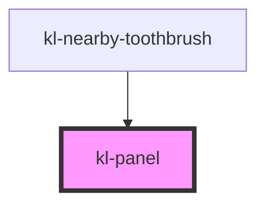

# kl-panel

<!-- Auto Generated Below -->

## Slots

| Slot | Description         |
| ---- | ------------------- |
|      | The panel's content |

## Shadow Parts

| Part     | Description |
| -------- | ----------- |
| `"base"` |             |

## Dependencies

### Used by

 - [kl-nearby-toothbrush](../kl-nearby-toothbrush)

### Graph

----------------------------------------------

*Built with [StencilJS](https://stenciljs.com/)*
