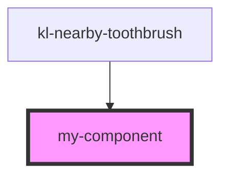

# my-component

<!-- Auto Generated Below -->

## Properties

| Property   | Attribute  | Description            | Type                                                      | Default     |
| ---------- | ---------- | ---------------------- | --------------------------------------------------------- | ----------- |
| `circle`   | `circle`   | Render a circle button | `boolean`                                                 | `false`     |
| `disabled` | `disabled` | Disables the button    | `boolean`                                                 | `false`     |
| `ghost`    | `ghost`    | Render a ghost button  | `boolean`                                                 | `false`     |
| `size`     | `size`     | The button's size      | `"large" \| "medium" \| "small"`                          | `'medium'`  |
| `variant`  | `variant`  | The button's variant   | `"neutral" \| "primary" \| "success" \| "text" \| "warn"` | `'primary'` |

## Slots

| Slot       | Description                                                        |
| ---------- | ------------------------------------------------------------------ |
|            | The button's label.                                                |
|            | prefix - Used to prepend an icon or similar element to the button. |
| `"suffix"` | Used to append an icon or similar element to the button.           |

## Shadow Parts

| Part       | Description |
| ---------- | ----------- |
| `"base"`   |             |
| `"label"`  |             |
| `"prefix"` |             |

## Dependencies

### Used by

 - [kl-nearby-toothbrush](../kl-nearby-toothbrush)

### Graph

----------------------------------------------

*Built with [StencilJS](https://stenciljs.com/)*
